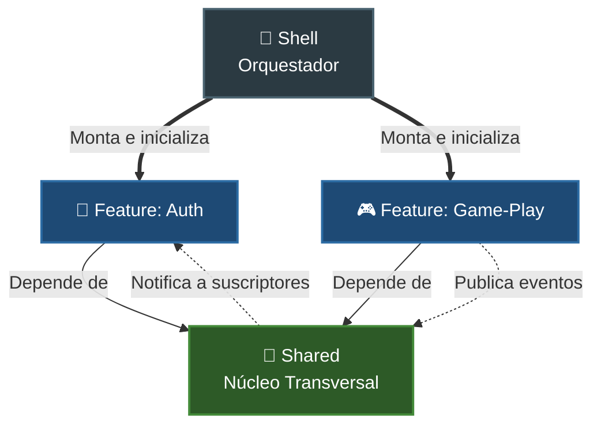

## 🗺️ Índice de Contenidos

### 🏁 Introducción

- [Sobre el Proyecto](#sobre-el-proyecto)
- [Cómo correr el Proyecto](#cómo-correr-el-proyecto)
- [Stack Tecnológico](#stack-tecnológico)

### 🏗️ Arquitectura

- [Estructura del Proyecto](#arquitectura-y-estructura-del-proyecto)
- [Módulos y Contextos](#módulos-de-la-aplicación)
- [Viabilidad para Microfrontends](#viabilidad-para-microfrontends)

### 🛠️ Ingeniería y Patrones

- [Filosofía: React como Motor Puro](#filosofía-de-diseño-react-como-motor-de-renderizado-puro)
- [Patrones de Diseño Aplicados](#patrones-de-diseño-implementados)
- [Estrategia de Testing](#estrategia-de-testing)
- [Diseño Basado en Tokens](#sistema-de-tematización-basada-en-tokens)

### 💎 Showcase Técnico

- [Extensión de Funcionalidades](#extensión-de-funcionalidades-y-diseño-de-producto)
- [Lecciones Aprendidas](#lecciones-aprendidas)
- [Easter Egg](#tematización-secreta-vía-url-easter-egg)

## Sobre el proyecto

Juego de memoria dinámico con sistema de autenticación, desarrollado como una prueba de concepto arquitectónica avanzada para el frontend. El objetivo principal es resolver el problema del alto acoplamiento y el "código espagueti" mediante la implementación estricta de **Clean Architecture y Domain-Driven Design (DDD)**.

## ⚙️ Cómo correr el Proyecto

### Local

```bash
npm install
npm run dev
```

### Tests

```bash
npm run test
```

## Stack Tecnológico

- **Lenguaje principal**: Typescript.
- **Framework / Librería de UI**: React.
- **Gestión de Estado**: Zustand
- **Herramientas de Soporte**: bcryptjs, canvas-confetti, graphql, vitest, @apollo/client.

---

## Arquitectura y Estructura del Proyecto

### Arbol principal

```
memory-game/
├─ src/
│  ├─ features/
│  │  ├─ auth/
│  │  │  ├─ application/         # Casos de uso (Login, Logout, Register, Password...) [*contiene __tests__]
│  │  │  ├─ domain/              # Errores, Modelos (User, Credentials...) y validadores de formato
│  │  │  └─ infrastructure/      # LocalUserRepository, AppAuthService, authStore y Formularios de UI
│  │  │
│  │  └─ game-play/
│  │     ├─ application/         # InitDeckUseCase
│  │     ├─ domain/              # Modelos (Card, GameSession, GameManager...) y validadores de juego
│  │     └─ infrastructure/      # Stores, HTML5GameEffects (audio) y UI (GameBoard, GameCard, GameSummary...)
│  │        └─ card-theme-providers/  # Proveedores de cartas (DBZ, Emojis, Pokémon, Ghibli, Simpsons...)
│  │
│  ├─ shared/                    # Capa transversal (Núcleo del sistema)
│  │  ├─ application/            # EventBus, HttpClient (Contratos)
│  │  ├─ domain/                 # Objetos genéricos (Result, UseCase, ValueObject...) y utils (arrayShuffler)
│  │  └─ infrastructure/         # Implementaciones: InMemoryEventBus, Fetch/Apollo HTTP, userSessionStore
│  │     └─ ui/                  # Componentes atómicos de diseño (Button, Heading, Paragraph, Spinner...)
│  │
│  └─ shell/                     # Pegamento técnico de la aplicación
│     ├─ App.tsx                 # Inicializador global y listeners
│     └─ router/                 # AppRouter, Guards de rutas y RootLayout
│
└─ [Configuraciones]             # vite, vitest, eslint, tsconfig, package.json...
```

### Mapa de relaciones

```
       ┌─────────────────────────────────────────────────────────┐
       │                          SHELL                          │
       │     (App.tsx, AppRouter, Guards, RootLayout, etc.)      │
       └────────────┬───────────────────────────────┬────────────┘
                    │               │               │
                    ▼               │               ▼
       ┌─────────────────────────┐  │    ┌─────────────────────────┐
       │      FEATURE: AUTH      │  │    │    FEATURE: GAME-PLAY   │
       │                         │  │    │                         │
       │  ┌───────────────────┐  │  │    │  ┌───────────────────┐  │
       │  │  Infrastructure   │  │  │    │  │  Infrastructure   │  │
       │  └─────────┬─────────┘  │  │    │  └─────────┬─────────┘  │
       │            ▼            │  │    │            ▼            │
       │  ┌───────────────────┐  │  │    │  ┌───────────────────┐  │
       │  │    Application    │  │  │    │  │    Application    │  │
       │  └─────────┬─────────┘  │  │    │  └─────────┬─────────┘  │
       │            ▼            │  │    │            ▼            │
       │  ┌───────────────────┐  │  │    │  ┌───────────────────┐  │
       │  │      Domain       │  │  │    │  │      Domain       │  │
       │  └───────────────────┘  │  │    │  └───────────────────┘  │
       └────────────┬────────────┘  │    └────────────┬────────────┘
                    │               ▼                 │
                    │      ┌─────────────────┐        │
                    └─────►│     SHARED      │◄───────┘
                           │                 │
                           │  - Application  │
                           │  - Domain       │
                           │  - Infra.       │
                           └─────────────────┘
```

## Módulos de la Aplicación

Están agrupado por contextos de negocio, lo que garantiza un alto nivel de cohesión y un bajo acoplamiento. Se dividen en cuatro grandes pilares:

### 🔐 1. Módulo de Autenticación (`features/auth`)

- **Qué hace:** Se encarga de registrar usuarios, iniciar sesión, recuperar contraseñas y destruir la sesión activa.
- **Aislamiento:** Este módulo ignora por completo la existencia del juego de memoria. Su única preocupación es validar credenciales y manejar el estado de autenticación (tokens/sesión) contra el repositorio local.

### 🎮 2. Módulo de Juego (`features/game-play`)

- **Qué hace:** Maneja la lógica del tablero, los turnos, la validación de las cartas (matches), los niveles de dificultad y los proveedores temáticos (Rick And Morty, Dragon Ball, Pokémon, etc.).
- **Aislamiento:** Es ciego respecto a cómo el usuario inició sesión. Recibe las interacciones del jugador y reproduce los efectos de sonido y visuales correspondientes.

### 🧰 3. Núcleo Compartido (`shared`)

- **Qué hace:** Contiene elementos que cualquier módulo puede importar libremente y no contiene reglas de negocio específicas.
- **Contenido clave:**
  - **UI:** Componentes atómicos de interfaz 100% reutilizables (`Button`, `Heading`, `ActionMessage`).
  - **Event Bus:** El sistema `InMemoryEventBus` que permite la comunicación asíncrona (Pub/Sub) en la aplicación.
  - **Dominio Base:** Tipos genéricos como `Result` (Result Pattern), utilidades de arrays (shufflers) y clientes HTTP (`Fetch`, `Apollo`).

### 🐚 4. Orquestador (`shell`)

- **Qué hace:** Es el punto de entrada superior de React. Aquí se montan las rutas globales (`AppRouter`, `RootLayout`), se protegen las vistas mediante `Guards` y se inyectan las variables del tema global (`initTheme`). Es el único lugar donde convergen las pantallas de `auth` y `game-play`.

---

### Regla de Comunicación entre Módulos

Para garantizar que la arquitectura sea escalable, existe una regla estricta de aislamiento: **Los módulos de negocio (`auth` y `game-play`) jamás se importan entre sí.** Cuando el módulo de juego necesita realizar una acción de autenticación (como cerrar la sesión desde el menú), no llama al servicio de Auth directamente. En su lugar, despacha un evento a través del **Event Bus** ubicado en `shared`, y el módulo de `auth` escucha este evento en segundo plano para ejecutar su Caso de Uso correspondiente, logrando un desacoplamiento del 100%.

### Diagrama de Dependencias y Comunicación

Iilustra la dirección estricta de las dependencias (líneas sólidas) y cómo se resuelve la comunicación cruzada entre módulos aislados sin romper la arquitectura (líneas punteadas):



## Viabilidad para Microfrontends

Al fragmentar la aplicación en contextos delimitados (_Bounded Contexts_) (`auth`, `game-play`, `shared`), el diseño ejemplifica cómo estructurar y construir una arquitectura de **Microfrontends**.

Cada módulo cuenta con su propio ciclo de vida, modelos y lógica aislada, comunicándose entre sí únicamente a través de contratos abstractos (interfaces) y un bus de eventos asíncrono (`InMemoryEventBus`). Esta separación radical permite que cada capa vertical de negocio pueda ser desacoplada, desplegada de forma independiente o integrada como un microfrontend autónomo en un contenedor principal sin generar colisiones ni dependencias cruzadas.

## Filosofía de Diseño: React como Motor de Renderizado Puro

La premisa central del proyecto es que **React debe hacer lo mínimo posible**. El framework no gobierna la aplicación; se reduce estrictamente a una capa de presentación ("Humble Object") encargada de pintar la interfaz y capturar eventos.

- **React como Detalle de Infraestructura:** Toda la lógica de negocio (reglas del juego, validaciones, gestión de sesiones) reside en archivos TypeScript puros (`domain` y `application`), ignorando por completo la existencia del framework.
- **Componentes sin Lógica:** Los archivos `.tsx` no contienen algoritmos ni efectos secundarios de red. Su único rol es mapear el estado reactivo global y delegar de inmediato las acciones del usuario (clicks, inputs) hacia los Casos de Uso.
- **Independencia del Framework:** Al mantener el núcleo del negocio agnóstico, la aplicación gana portabilidad total. Si se decidiera cambiar la interfaz a Vue, Angular o Svelte, el 100% de la lógica de juego (`game-play`) e identidad (`auth`) se reutilizaría intacta.
- **Testabilidad Ágil:** Al vaciar los componentes de código pesado, se elimina la dependencia de herramientas complejas de emulación del DOM (como React Testing Library) para validar las reglas de negocio. El core se evalúa mediante pruebas unitarias puras y ultrarrápidas sobre archivos `.ts` nativos.

## Patrones de Diseño Implementados

Para garantizar la mantenibilidad, la facilidad de pruebas y el desacoplamiento, se aplicaron los siguientes:

### 1. Patrón Repositorio (Repository Pattern)

- **Implementación:** Define contratos abstractos en `domain/repository` (ej. `UserRepository.ts`) y sus implementaciones concretas en `infrastructure/persistence`.
- **Beneficio:** Permite cambiar el origen de datos (localStorage, API REST, etc.) modificando solo la infraestructura, sin tocar la lógica de negocio.

### 2. Patrón Result (Result Pattern)

- **Implementación:** Centralizado en `shared/domain/models/Result.ts`, encapsula las respuestas de los casos de uso y repositorios en estados controlados (éxito/error).
- **Beneficio:** Elimina el uso excesivo de `try/catch` y previene caídas inesperadas, obligando a la UI a gestionar los errores mediante tipado estricto.

### 3. Publicador/Suscriptor (Pub/Sub Pattern)

- **Implementación:** Sistema asíncrono gestionado a través de `shared/infrastructure/bus/InMemoryEventBus.ts`.
- **Beneficio:** Desacopla los módulos (ej. `game-play` y `auth`), permitiendo que interactúen mediante eventos sin necesidad de importarse físicamente.

### 4. Patrón Fábrica (Factory Pattern)

- **Implementación:** Gestionado en `RawCardThemeProviderFactory.ts` para la creación de skins y colecciones de cartas.
- **Beneficio:** Centraliza la lógica para decidir qué proveedor (PokéAPI, Emojis, etc.) instanciar según la configuración de la partida.

### 5. Objeto de Valor (Value Object)

- **Implementación:** Clases como `LoginCredentials` y `PlayerProgress` encapsulan sus propios datos y reglas de validación.
- **Beneficio:** Garantiza modelos de dominio siempre válidos (ej. impide crear progresos con "movimientos negativos") al rechazar instanciaciones incorrectas.

### 6. Método de Fábrica Estático (Static Factory Method)

- **Implementación:** Constructores privados combinados con métodos estáticos explícitos como `PlayerProgress.create()` o `LoginCredentials.create(props)`.
- **Beneficio:** Mejora la semántica y legibilidad de la instanciación, centralizando la ejecución de validaciones previas.

### 7. Inmutabilidad (Principio de Diseño)

- **Implementación:** Ausencia de métodos mutadores (`setters`); métodos como `incrementMatch()` devuelven una nueva instancia completa.
- **Beneficio:** Previene efectos secundarios (_side-effects_) impredecibles, garantizando un flujo de datos seguro y estable para la reactividad en React.

## Estrategia de Testing

- **Dominio**: Tests unitarios puros (Vitest).
- **Infraestructura**: Validación de Stores y persistencia.
- **UI**: Tests de componentes (RTL) centrados en interacción visual.

## Sistema de Tematización Basada en Tokens

Para lograr que cada partida del juego se sienta única, se implementó una arquitectura de **Design Tokens** que desacopla el estilo visual de los componentes de la temática actual.

### ¿Cómo funciona?

En lugar de usar clases de CSS estáticas, la aplicación consume un contrato tipado `ThemeTokens`. Cuando un usuario elige o cambia un tema (ej. de _Pokémon_ a _Dragon Ball_):

1. **Abstracción:** El proveedor de cartas (`CardThemeProvider`) entrega su objeto de configuración con los colores, logos y fondos definidos.
2. **Inyección en el Runtime:** La función `setGlobalThemeVariables(tokens)` mapea este objeto a variables CSS nativas (`--container-bg`, `--primary-action`, etc.) en el nivel raíz del documento.
3. **Reactividad Visual:** Los componentes de UI (`Surface`, `Button`, `GameLayout`) simplemente consumen estas variables CSS. El resultado es que **toda la interfaz se "repinta" automáticamente** sin recargar la aplicación ni inyectar nuevo CSS.

## Extensión de Funcionalidades y Diseño de Producto

Aunque el diseño original (Figma) contemplaba únicamente la pantalla de login, el desarrollo se expandió para cubrir el ciclo de vida completo de un usuario. Esto implicó la creación de los Casos de Uso y la lógica de negocio completa necesaria para su funcionamiento:

### Flujos Implementados de Cero

Se implementaron los siguientes casos de uso:

- **Registro de Usuarios (`RegisterUseCase`):** Implementación de lógica de validación de usuarios, almacenamiento y encriptación.
- **Gestión de Recuperación de Contraseña:**
  - `SendRecoverPasswordCodeUseCase`: Flujo de solicitud de código de recuperación. 
  - **Nota técnica**: Este caso de uso simula el envío de un correo donde se encuentra un URL para recuperar la password mediante un log en la consola.
  - `RestorePasswordUseCase`: Lógica de validación y cambio de credenciales.
- **Sesión:**
  - `LogoutUseCase`: Manejo seguro de la destrucción de sesión.
  - `RetrieveUserInfoUseCase`: Recuperación de datos del usuario activo para el dashboard.

### Simulación de Persistencia

Dado que el requerimiento original era un prototipo, se implementó una **infraestructura de persistencia simulada** (`LocalUserRepository.ts`). Esta capa permite que toda la aplicación funcione de forma autónoma, simulando una base de datos real mediante el uso de `localStorage` y servicios de autenticación (`AppAuthService.ts`), garantizando que los flujos tengan persistencia real durante la navegación del usuario.

## Lecciones Aprendidas

- **Desacoplamiento Real**: La implementación del `EventBus` fue clave para evitar que el módulo `game-play` tuviera que conocer los detalles internos de `auth`. Este enfoque de comunicación asíncrona demostró ser superior a cualquier intento de importación directa entre dominios.
- **Testing de Negocio**: Al mover la lógica a TypeScript puro (fuera de los componentes de React), el tiempo de ejecución de los tests se redujo drásticamente al eliminar la necesidad de emular el DOM o renderizar árboles de componentes para validar reglas de negocio.
- **Over-engineering vs. Escalabilidad**: El patrón `Factory` pareció una abstracción excesiva al inicio del proyecto; sin embargo, fue precisamente esa estructura la que permitió integrar 9 temas diferentes (Pokémon, DBZ, Emojis, etc.) sin necesidad de tocar una sola línea de código en el núcleo del juego.
- **Consistencia mediante Value Objects**: La adopción de Value Objects para encapsular reglas de negocio y validaciones resultó fundamental. Al centralizar la lógica de validación dentro de estos objetos, eliminé la duplicidad de código, garantizando que los datos sean siempre válidos sin importar desde qué parte de la aplicación (UI, Casos de Uso o Repositorios) se instancien.
- **Flujos de Error sin Excepciones (Patrón Result)**: Centralizar las respuestas de los casos de uso mediante el patrón Result permitió manejar errores como datos en lugar de como interrupciones (try/catch) en los casos de uso.
- **Componentes Stateless por Diseño**: Al delegar toda la lógica a los Casos de Uso, la UI se limitó a reflejar estados inmutables, logrando que el ciclo de vida de React sea casi inexistente (implementando apenas un useEffect para suscripciones globales), lo que reduce drásticamente la superficie de errores de renderizado.

## Tematización Secreta vía URL (Easter Egg)

Cambia la temática global usando parámetros en la URL.

### Temas:

- dragonBall
- studioGhibli
- pokemon
- rickAndMorty
- theSimpsons
- countries
- numbers
- colors
- emojis

```
Ej: http://localhost:5173/?theme=pokemon
```
